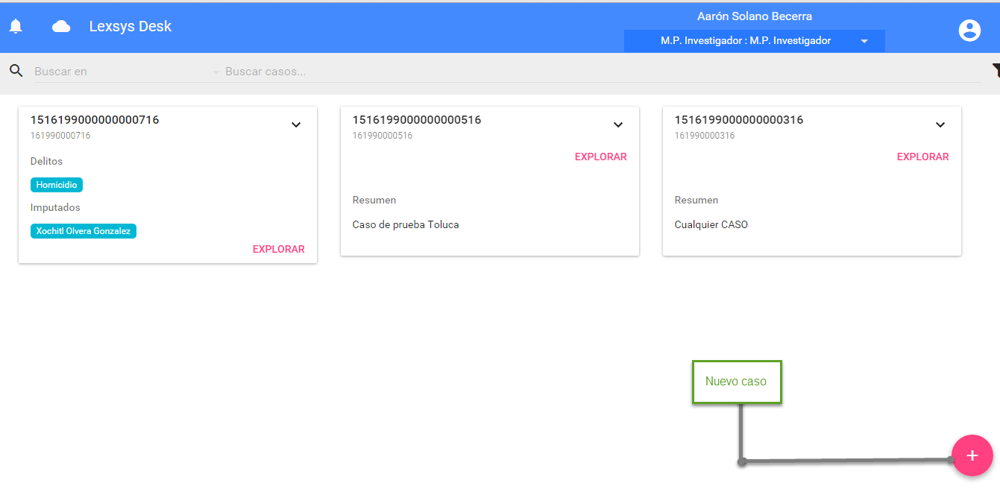
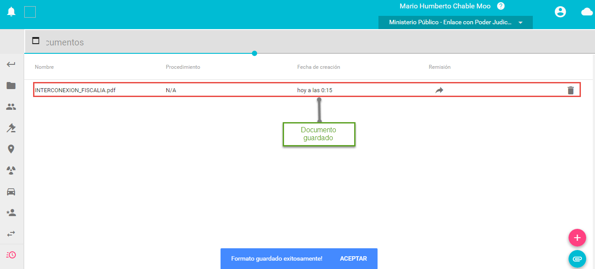

# Manual de usuario LEXSYS
--------------------------------------

El presente manual ha sido desarrollado de manera generica para adaptarse a cualquier cliente, sin embargo para cada cliente algunas
pantallas, procedimientos, iconos, nombres, etc. pueden cambiar, para el caso los procedimientos se generará un anexo donde se podrá contar con
el detalle de cada uno de estos procedimientos con sus formularios y formatos.

### Objetivo
--------

A continuación se presenta una guía de usuario del Escritorio de Trabajo (ET) donde aprenderemos a usar cada una de las características de dicha
herramienta.

El presente documento ha sido elaborado para guiar a los usuarios operativos del Sistema de Gestión en el manejo de la plataforma
informática, específicamente lo que respecta al denominado Escritorio de Trabajo (ET), donde se llevan a cabo las labores de documentación y
generación de formatos impresos que resultan del proceso de gestión de justicia penal acusatorio.

Aunque el ET es una interfaz completamente intuitiva, veremos una detallada explicación del uso y manejo de esta interfaz.

### Introducción 
------------

El Sistema Informático de Gestión para las instituciones que participan en el Procedimiento Penal sistematiza los procesos de gestión del Nuevo
Sistema de Justicia Penal Acusatorio.

Las múltiples funcionalidades del Sistema Informático de Gestión brindan el apoyo, seguimiento y control necesario a los procesos en donde
interviene la Institución donde se implementa el Sistema de Gestión Informático, apoyando su interconectividad con otros operadores de
instituciones que forman parte del proceso penal, desde la noticia criminal, durante la investigación, persecución y juicio, hasta la
ejecución de sentencias y el tratamiento previo a la liberación, conservando de principio a fin la participación y gestión de la defensa,
traduciéndose en una mayor rápidez y eficacia en las comunicaciones, recursos procesales y ejecución de sentencias.

El Escritorio de Trabajo (ET) del sistema pone a disposición del Usuario operativo (sobre una aplicación web), un amplio conjunto de herramientas que le permiten realizar tareas de captura, asignación de casos, consulta, seguimiento del caso, remisión de documentos, entre otras opciones.

### Breve descripción de la Funcionalidad. 
--------------------------------------

El Sistema Informático de Gestión sistematiza los procesos de gestión del Nuevo Sistema de Justicia Penal Acusatorio en el Estado
particularmente en el ámbito de la procuración de justicia bajo la responsabilidad de la Procuraduria General de Justicia.

Las múltiples funcionalidades de LEXSYS brindan el apoyo, seguimiento y control necesario a los procesos, apoyando su interconectividad con
otros operadores de instituciones que forman parte del proceso penal, el proceso desde la noticia criminal, durante la investigación, persecución y juicio, hasta la ejecución de sentencias y el tratamiento previo a la liberación, conservando de principio a fin la participación y gestión de la defensa, traduciéndose en una mayor rapidez y eficacia en las comunicaciones, recursos procesales y ejecución de sentencias.

El Sistema de Gestión cuenta fundamentalmente con: Una Base de Datos centralizada para la provisión del Número Único de Causa (NUC)
transversal para todos los operadores; un Escritorio de Trabajo que permite la continuidad operativa sin conexión en un esquema híbrido.

#### Manual de usuario del Escritorio de Trabajo (ET)
--------------------------------------

En este manual detallaremos el uso y manejo de cada módulo y elemento del denominado Escritorio de Trabajo, que en lo sucesivo llamaremos ET,
Donde el usuario podrá gestionar la captura de un nuevo caso, la búsqueda de casos, el seguimiento, procedimientos y formatos.

Abordaremos los dos métodos de ingreso al ET, el modo Web es el modo común que usaremos para conectarnos a la aplicación y el modo
Contingencia que se usará cuando la conexión al servidor central este fuera de línea, es decir que el usuario no tenga de algún modo
comunicación con el servidor central, sea cual sea la razón.

#### Modo de acceso Web al Escritorio de Trabajo (ET)
--------------------------------------

Para firmarnos en este modo basta con abrir cualquier navegador, en caso de la elaboración de este manual se utilizó Google Chrome, mismo que se
recomienda para el uso del Sistema Informático de Gestión.

    Imagen 1 (Google Chrome)

Una vez abierto el navegador deberemos teclear una dirección URL del tipo http://midominio o bien del tipo XXXX.XXXX.XXXX.XXXX:3001, donde
3001 es el puerto por donde nos comunicamos con el Portal de Servicios.

    Imagen 2 (URL)

Una vez escrita la dirección damos enter y veremos una ventana que nos indicará el inicio de sesión, nos pedirá el usuario y contraseña así
como el botón de entrar, es decir estamos frente a la pantalla de login.

    Imagen 3 (Login)

#### Modo de acceso Contingencia al Escritorio de Trabajo (ET)
---------------------------------------------------------

El modo Contingencia es una alternativa para las Unidades Estrategicas de Negocio de la Operación y administración estadistíca de la
procuración de justicia que por alguna razón no están on line y que deben continuar con la operación, para acceder al modo Contingencia se
deben cumplir ciertos requisitos técnicos previos los cuales deberán ser cubiertos por parte de los ingenieros de soporte del cliente.

Una vez instalado el cliente del Escritorio de Trabajo veremos un acceso directo en el escritorio de nuestra PC.

    [Pendiente por diseñar]

    Imagen 4 (Acceso directo)

Ya que localizamos el acceso directo damos doble ‘click’ para abrirlo y se abrirán dos ventanas la primera es una consola donde veremos que el
servicio se ha levantado, sirve para monitorear el servicio y sincornizar el cliente de contingencia con el servidor central, es
importante no cerrar esta ventana; la segunda es una ventana del navegador misma que nos remite a la ventana de login mencionada con
anterioridad.

    Imagen 5 (Login contingencia)

Si por alguna razón no nos firmamos de manera correcta en la pantalla de login nos regresará un mensaje de error mismo que se muestra en la
siguiente imagen.

    Imagen 6 (Error login)

### Elementos del escritorio de Trabajo
--------------------------------------

Son los componentes del Escritorio de Trabajo con los que el usuario
deberá familiarizarse para el uso de la herramienta:

    1.- Alertas
    2.- Barra de Búsqueda
    3.- Filtro
    4.- Datos del usuario
    5.- Espacio de trabajo
    6.- Nuevo caso
    7.- Salir

En la siguiente imagen se muestra y señala cada uno de estos elementos.

    Imagen 7 ( Elementos del Escritoro de Trabajo)

A continuación describiremos cada uno de los elementos que conforman el
Escritorio de Trabajo:

    1.- Las Alertas: Señalan al usuario que le ha llegado un nuevo caso o le ha sido remitido un nuevo documento.
    2.- Barra de Búsqueda: Facilita la búsqueda de casos por NIC, NAC y NUC
    3.- Filtro: Delimita la búsqueda del caso mediante la fecha.
    4.- Datos del usuario: Muestra el nombre del usuario y su plaza, si el usuario está asignado a dos o más plazas puede cambiar sin salir de la sesión.
    5.- Espacio de Trabajo: Es el espacio donde se muestran los casos actualmente creados.
    6.- Nuevo Caso: Es donde iniciaremos la captura del nuevo caso, es donde trabajaremos con los procedimientos y seguimiento del caso.
    7.- Salir: Es el botón que se usa para salir de la herramienta de manera correcta.

#### Alertas
-------

Las Alertas las podemos identificar por el símbolo de una campana como se muestra en la siguiente ilustración, las notificaciones podemos
visualizarlas presionando el botón de la campana y se desplegarán las notificaciones o bien podemos mantenerlas ocultas presionando nuevamente
el botón de la campana y estas permanecerán ocultas dejandonos un mayor espacio de trabajo.

    Imagen 8 (Alertas ocultas)

A continuación veremos que al presionar el símbolo de la "Campana" se despliegan todas las Alertas

    Imagen 9 (Alertas desplegadas)

Como lo mencionamos las Alertas nos comunican si hemos sido asignados a alguna titularidad, si hemos recibido algún caso, si nos han remitido
algún documento, etc.

Una vez que desplegamos las Alertas visualizaremos un panel con los siguientes elementos:

    * Barra de Búsqueda de Alertas

    * Filtro

    * Tipo de Alerta:

        - Titularidad asignada
        - Caso recibido
        - Remisión de documentos
        - Documento compartido

    * Caso asociado al tipo de notificación

Panel de Alertas

    Imagen 10 (Panel de Alertas)

#### Barra de búsqueda de Alertas. 
--------------------------------------

La busqueda de Alertas es util para localizar una Alerta en especifico, usando los siguientes parametros

    - Palabra clave
    - NUC
    - NIC
    - NAC

#### Filtro de Alertas
--------------------------------------

Un atributo muy util para delimitar la búsqueda de las Alertas en un periódo de tiempo.

#### Tipos de Alertas
--------------------------------------

Son las diferentes notificaciones con las que el sistema nos anuncia las diferentes tareas respecto a algún caso:

    - Titularidad asignada: La herramienta puede balancear la carga de trabajo de los diferentes operadores y asigna los casos de tal manera que distribuye la asignación de los casos entre los usuarios de cada operador.

    - Caso recibido: La aplicacion nos anuncia mediante una Alerta que hemos recibido un caso.

    - Remisión de documentos: Nos anunciará cuando recibamos un formato.

    - Documento compartido: se genera esta Alerta cuando hemos compartido un documento.

#### Resumen del caso
--------------------------------------

Nos da una breve descripción del caso en cuestión nos ayuda a identicar de manera más clara el caso que buscamos.

#### Documento remitido
--------------------------------------

Una vez que hemos remitido un documento nos aparecerá una Alerta con esta ultima actividad actualizada y nos dirá que documento hemos
compartido y la posibilidad de descargarlo

#### Búsqueda de casos 
-----------------

Continuando con los Elementos del Escritorio de Trabajo:

La barra de Búsqueda de casos, es una herramienta muy útil si se esta buscando un caso en especifico pero no se tienen los datos del mismo,
podemos hacer uso de esta herramienta ya que puedes usar varios criterios de búsqueda tales como:

    + Palabra clave
    + NUC
    + NIC
    + NAC
    + Delito

Para comenzar la búsqueda es importante seleccionar donde queremos buscar, para ello tenemos dos opciones Local o En línea, la primera
opción se usa cuando usamos el modo contingencia y la segunda opción cuando estamos en el modo web, cuando seleccionamos la persiana se
desplegarán las opciones mencionadas como se ilutra en la siguiente imagen:

    Imagen 11 (Búscar en)

Cuando seleccionamos la opción apropiada entonces buscamos un caso en este ejemplo usamos el NUC para buscar el caso

    Imagen 12 (Búscar caso)

El resultado será el siguiente:

    Imagen 13 (Resultado de la búsqueda)

#### Filtro de casos
---------------

El Filtro es una herramienta para delimitar la búsqueda mediante un rango de fechas en las cuales es probable que este el objetivo de
nuetras búsqueda, en la figura vemos como se despliega el filtro al seleccionar cualquiera de los rangos de búsqueda como fecha inicial
vemos como se despliega un calendario donde podremos seleccionar la fecha de inicio y la fecha final de la búsqueda.

    Imagen  14 (Filtro)

#### Datos del usuario
-----------------

Los Datos del usuario hacen referencia al nombre del usuario que esta firmado en la herramienta, así como al puesto y plaza que tiene
asignado.Justo como vemos en la siguiente imagen:

    Imagen 15 (Datos del usuario)

Si existiera el caso que el usaurio tiene asignadas dos plazas puede cambiarse entre ellas presionando la flecha hacia abajo que se muestra
en seguida del puesto asignado, se desplegara una persiana con las diferentes plazas que tiene asignadas y puede ejecutar el cambio de
plazas sin cerrar sesion como lo vemos en la siguiente ilustración.

    Imagen 16 (Cambio de plazas)

#### Espacio de Trabajo
------------------

El Espacio de Trabajo es panel donde nos mostrará los casos donde hemos trabajado, se desplegarán recuadros con información de los casos, como
el NUC, el resumen y un botón de "explorar" mismo que nos abrirá el caso en cuestión, como se muestra en las siguientes imagenes:

    Imagen 17 (Espacio de Trabajo)

Cuando seleccionamos el botón "exolorar" el resultado esperado es la apertura del caso en cuestión como se muestra en la siguiente imagen:

    Imagen 18 (Botón Explorar)

#### Botón Salir 
-----------

No hay mucho que decir al respecto para realizar un cierre de sesión correcto es importante seguir las siguientes instrucciones: dar click
sobre el símbolo superior derecho que representa una persona en un círculo blanco, inmediatamente aparecerá la opción para "salir"
presionamos esta opción y habremos salido del sistema con in cierre de sesión exitoso.

    Imagen 19 (cierre de sesión1)

Cuando presionamos el símbolo marcado en la imagen anterior obtendremos:

    Imagen 20 (cierre de sesion2)

Al presionar "Salir" nos devolverá a la pantalla principal de Login.

## Nuevo caso
--------------------------------------

Merece un apartado especial este elemento del ET ya que es el elemento principal del Escritorio de Trabajo, este es el comienzo de la captura
del nuevo caso, para generar un nuevo caso deberemos presionar el botón con el símbolo de "+" como se muestra a continuación

    Imagen 21 (Nuevo caso)

A partir de este momento el usuario se encontrará con la consola de trabajo misma que explicaremos a continuación. Una vez que pulsamos el
botón Agregar caso nuevo, veremos el panel del Escritorio de Trabajo.

    Imagen 22 (Escritorio de trabajo nuevo caso)

Una vez seleccionado el botón con el símbolo del "Engrane" veremos que nos aparece la siguiente pantalla donde podremos seleccionar los
elementos para completar la fundamentación del caso.

    Imagen 23 (Escritorio de trabajo nuevo caso1)

Una vez que escribimos la palabra clave para buscarlo en el catalogo de delitos que hayamos seleccionado, entonces damos enter y entonces
veremos la siguiente ventana:

    Imagen 24 (Escritorio de trabajo nuevo caso)

Es así como se generá el caso nuevo con los "Datos generales" una vez guardado este módulo se activarán el resto de los módulos.

    Imagen 25 (Escritorio de trabajo nuevo caso)

### Iconografía del Escritorio de Trabajo rabajo}
-------------------------------------

Describiremos a continuación la iconografía que usa la consola de trabajo y que serán nuestras herramientas durante el proceso de captura
del nuevo caso, podemos visualizar los iconos de trabajo en la siguiente imagen:

    Imagen 26 (Iconografia)

​1) Regresar a la pantalla principal: Regresa a la pantalla de inicio del Escritorio de Trabajo.

​2) Identificación del caso/Datos Generales: Contiene información acerca de la ubicación, Identificación y descripción.

​3) Datos de Personas: Es el módulo donde donde se captura el tipo de actor que esta ante la autoridad tales como:

         - Imputado
         - Víctima
         - Ofendido
         - Denunciante
         - Querellante
         - Testigo
         - Representante
         - Solicitante
         - Requerido
         - Representante: Asesor jurídico|Defensor público.

​4) Datos del delito: Es aquí donde se capturan los datos del Delito asi como la fórmula del delito entre otros.

​5) Datos de lugares involucrados con el caso: Es donde se capturan los datos de los lugares de los hechos y de los lugares del hallazgo.

​6) Datos de las armas involucrados con el caso: Se llenará si es que hubo un arma de cualquier tipo.

​7) Datos de vehículos relacionados con el caso: Son los vehículos recuperados por las autoridades.

​8) Autoridades involucradas: Titulares del caso (Se carga en automático)

​9) Relaciones: Es un atributo para dejar documentado la relación que existe entre los datos del caso.

​10) Seguimiento: Se da seguimiento a los documentos y procedimientos por atender.

​11) Documentos: Es una bandeja donde están los Documentos recibidos y enviados.

## Datos Generales/Identificación del caso 
---------------------------------------

De primera instancia la Identificación del caso es la primera pantalla que vemos propiamente ya interactuando con la herramienta y el nuevo
caso, esta primera pantalla contiene lo siguiente:

    - NAC: Es el identificador nuevo del caso mismo que la herramienta genera al guardar el caso, este identificador es único (Número de Acceso al Caso).

    - Distrito Judicial

    - Municipio

    - Entidad federativa

    - Localidad

    - Resumen: Descripción del caso de manera general, este resumen nos permitirá distinguirlo cuando se tenga que buscar.

Cabe mencionar que esta información es llenada por el operador que inicia el caso y hasta que no se llenen los datos generales del caso y
se guarden los mismos, no se activará el resto de las opciones para dar continuidad al caso.

    Imagen 27 (Datos Generales del caso)

El resultado es el siguiente una vez que presionamos el botón "Guardar", como vemos nos ha asignado un NAC y un NIC y hasta que no generemos un
procedimiento no nos asignará un NUC.

    Imagen 28 (Resultado captura datos generales)

## Datos de personas
-----------------

Para agregar un nuevo elemento en este módulo es necesario haber guardado los datso generales como se hizó en el apartado anterior. De
tal suerte que para agregar el nuevo elemento de (Personas) debemos presionar el botón con el símbolo "+", cabe mencionar que debemos estar
posicionarnos en el módulo (Datos personas).

    Imagen 29 (Nuevo elemento)

Es el módulo donde se captura el tipo de actor que esta ante la autoridad.

Los diferentes tipos de actores que participan en el caso son los siguientes:

       Imputado
       Víctima
       Ofendido
       Denunciante
       Querellante
       Testigo
       Representante
       Solicitante
       Requerido
       Representante: Asesor Jurídico|Defensor Público

    Imagen 30 (Actores)

Al seleccionar cualquiera de los actores (excepto imputado), el resto de las opciones de captura se activarán como se muestra a continuación

    Imagen 31 (Datos de personas)

Una vez seleccionado el tipo de actor lo que continua es llenar los datos siguientes:

    * Tipos de personas
    * Datos de identidad
    * Datos de situación
    * Datos de identificación
    * Datos de localización
    * Media filiación

Mismos que detallaremos a continuación

### Datos de identidad (persona)
----------------------------

Este apartado nos permitirá capturar los datos básicos de identidad del actor presente ante la autoridad (los campos marcados en rojo son
mandatorios)

       Nombre
       Apellido Paterno
       Apellido Materno
       Sexo
       Fecha de Nacimiento
       Edad 
       Lugar de Nacimiento
       Nacionalidad
       RFC
       CURP

La siguiente imagen nos muestra como se ve esta pantalla:

    Imagen 32 (Datos de identidad)

### Datos de situación 
------------------

El apartado presente permite ingresar la situación económica, alfabetica, laboral y civil del actor presente, para ello se capturan
los siguientes datos:

       Escolaridad
       Estado Civil
       Ocupación
       Lugar de Trabajo
       Dependientes Económicos
       Ingresos
       Religión
       Adicciones
       Relación con los involucrados

En la siguiente pantalla podemos ver como se distribuyen los datos que nos solicitará el sistema

    Imagen 33 (Datos de situación)

Donde los siguientes campos tienen las siguientes opciones

Exsiten además los siguientes campos que el usuario captura manualmente

    + Religión
    + Ocupación
    + Lugar de trabajo
    + Ingresos mensuales
    + Adicciones
    + Relación con los involucrados

### Datos de identificación 
-----------------------

El apartado que acontinuación se describe, nos permite ingresar los datos de identificación que el actor frente a la autoridad presenta.

    - Documento de identificación: donde tendrá las siguientes opciones para elegir:

           Credencial de Elector
           Licencia para conducir
           Credencial Laboral
           Credencial Escolar
           Cartilla Servicio Militar
           Pasaporte
           Acta de nacimiento
           Otro

    - Otro: hacer referencia al  campo anterior de identificación donde la persona se idéntica con otro documento diferente al listado anterior.

        o   Autoridad Emisora.
        o   Número o Folio de Identificación.

A continuación se muestra una imagen con los datos de captura

    Imagen 34 (Datos de identificación)

Al seleccionar documento de identificación veremos las opciones siguientes:

    Imagen 35 (Datos de identifiacion)

### Datos del imputado
------------------

Para el caso del imputado dedicaremos un espacio especial ya que contiene datos de suma importancia que no contienen los formularios del
resto de los actores comenzaremos por los datos básicos al igual que el resto de los actores o personas que estan involucrados en el caso.

    Imagen 36 (Datos imputado)

### Datos de identidad
--------------------------------------

Igual que en el resto de los actores, en el caso del imputado es necesario conocer los datos básicos de identidad.

    o   Nombre
    o   Apellido Paterno    
    o   Apellido Materno
    o   Sexo
    o   Fecha de Nacimiento
    o   Edad 
    o   Lugar de Nacimiento
    o   Nacionalidad
    o   RFC
    o   CURP

En la siguiente imagen podemos confirmar los datos que nos solicitan:

    Imagen 37 (Imagen datos de identidad del imputado)

### Datos de situación 
--------------------------------------

Como en el caso anterior, al imputado debe completarse un expedinte con su situación laboral, civil, adicciones, escolaridad entre otras ya que
estos datos serviran para generar reportes al respecto.

    o   Escolaridad
    o   Estado Civil
    o   Ocupación
    o   Lugar de Trabajo
    o   Dependientes Económicos
    o   Ingresos
    o   Religión
    o   Adicciones
    o   Relación con los involucrados

La siguiente imagen nos muestra como se ve la pantalla de datos de
situación

    Imagen 38 (Datos de situación)

### Datos de identificación
--------------------------------------

El imputado debe identificarse con cualquier documento mencionado en este listado y a su vez debe capturarse el detalle de esta
identificación.

    - Documento de identificación

        o   Credencial de Elector
        o   Licencia para conducir
        o   Credencial Laboral
        o   Credencial Escolar
        o   Cartilla Servicio Militar
        o   Pasaporte
        o   Acta de nacimiento
        o   Otro

    - Autoridad emisora

    - Número o folio de documento

En la siguiente imagen se muestra como se distribuyen en pantalla los campos mencionados

    Imagen 39 (Datos de identificación)

### Datos de localización 
--------------------------------------

Dentro del sistema encontraremos los datos de localización del imputado mismos que deben capturarse debido a su importancia de integrarse al
expediente y obviamente para la localización de su domicilio o domicilios.

    o   Calle
    o   En el/frente al número exterior Credencial Laboral
    o   No. Interior
    o   Colonia
    o   Localidad/Ciudad
    o   Municipio/Delegación
    o   CP
    o   Estado
    o   País
    o   Tel. Particular
    o   Tel.  Trabajo Ext.
    o   Fax
    o   Tel. Móvil
    o   Correo
    o   Otro Medio de Contacto

En la siguiente imagen se muestra la pantalla de Datos de localización

    Imagen 40 (Datos de localización)

### Media filiación
--------------------------------------

Es la descripción precisa de los diferentes rasgos del individuo que en este caso corresponden al imputado, es en este módulo donde se captura
cada rasgo físico de la persona denominada imputado, sirve para dejar acentadas las características fisicas del individuo en cuestión, en este
módulo existen varias opciones de captura para que el usuario llene complete la descripción precisa del individuo.

    - Complexión
        + Regular
        + Robusta
        + Ateltica
        + Obesa

    - Piel
        + Albino
        + Blanco
        + Amarillo
        + Moreno claro
        + Moreno Oscuro
        + Moreno
        + Negro
        + Otro

    - Cara
        + Alargada
        + Cuadrada
        + Ovalada
        + Redonda

    - Cabello
        + Cantidad
        + Color
        + Forma
        + Calvicie
        + Implantación

En la siguiente imagen podemos ver esta parte de la media filiación

    Imagen 41 (Media filiación 1)

Continuando con la Media filiación estos son otros datos que nos solicita la aplicación

    - Frente
        + Altura
        + Inclinación
        + Ancho

    - Cejas
        + Dirección
        + Implantación
        + Forma
        + Tamaño

    - Ojos
        + Color
        + Forma
        + Tamaño

    - Nariz
        + Raíz (Prof.)
        + Dorso
        + Ancho
        + Base
        + Altura

La siguiente imagen es la continuación de la Media filiación

    Imagen 42 (Media filiación 2)

Continuando con la Media filiación tenemos

    - Boca
        + Tamaño
        + Comisuras

    - Labios
        + Espesor
        + Altura naso-labial
        + Prominencia

    - Mentón
        + Tipo
        + Forma
        + Inclinación

    - Oreja derecha
        + Forma
        + Helix-Original
        + Hélix-Superior
        + Hélix-Posterior
        + Hélix-Adherencia
        + Lóbulo-Contorno
        + Lóbulo – Adherencia
        + Lóbulo – Particularidad
        + Lóbulo – Dimensión

La imagen a continuación muestra la tercera parte de la Media filiación

    Imagen 43 (Media filiación 3)

Otros datos correspondientes a la Media filiacion son los siguientes:

    - Sangre
        + Tipo
        + Factor RH
    - Talla
        + Estatura
        + Peso (kg)

    - Señas particulares
        + Usa anteojos
        + Cicatrices
        + Tatuajes
        + Lunares
        + Defectos físicos
        + Prótesis
        + Otras

La imagen que a continuación se muestra corresponde a datos más partículares del imputado.

    Imagen 44 (Media filiación 4)

Para el caso del actor denominado Representante todos los campos que se capturan son iguales al resto de los actores excepto por el campo que se
integra es Representados:

    - Nombre del o los representados.

La siguiente imagen corresponde al actor Representante

    Imagen 45 (Representante)

## Delitos
-------

En este punto veremos los elementos para agregar un delito y armar la
fórmula del delito, realmente es muy sencillo, recordemos que estamos
alineados al Código Nacional y en el catalogo encontraremos los delitos
que complementen esta fórmula.

Para crear un delito nuevo, es muy sencillo, basta con presionar el
botón, "+" dentro del módulo de delitos obtendremos la siguiente
pantalla.

    Imagen 46 (Agregar nuevo delito)

Una vez presionado el botón "+" veremos la siguiente pantalla con los
campos que debemos llenar mismos que explicaremos a continuación de la
imagen:

    Imagen 47 (Nuevo delito)

Esta pantalla contiene un formulario con los siguientes datos de
captura:

    - Nombre: el nombre del delito de acuerdo al Código Nacional

    - Fundamentación: es la fórmula del delito.

    - Redacción: Descripción breve del caso.

    - Clasificadores estadísticos:

        - Forma de comisión.
            * Doloso
            * Culposo
            * No se sabe

        - Forma Acción
            * Con violencia
            * Sin violencia
            * No se sabe

        - Modalidad.
            * Simple
            * Atenuado
            * Agravado
            * Calificado
            * Sin modalidad

        - Elementos de comisión.
            * Con arma de fuego
            * Con arma blanca
            * Con alguna parte del cuerpo

        - Consumado
            * Consumado
            * Tentativa
            * No aplica
            * No específicado

        - Flagrancia.

A continuación se muestra una imagen de este formulario

    Imagen 48 (Delitos)

### Búscar fundamentación
--------------------------------------

Fundamentación es la opción donde podremos agregar el fundamento de un delito (artículo del Código Nacional) para agregar el delito, es
necesario presionar el botón con el símbolo del "Engrane" nos desplegará la siguiente pantalla.

    Imagen 49 (Fundamentación)

Buscar fundamentación: en este campo escribimos el nombre del delito, damos enter o bien en la "Lupa" al realizar esta acción nos desplegará
la lista de delitos asociados a ese nombre, por ejemplo:

    Imagen 50 (Búscar fundamentación)

Una vez escrito la palabra de un delito por ejemplo homiciodo y presionar el botón de la "Lupa" nos desplegará una lista de artículos de
los delitos asociados a la palabra escrita en el campo "Buscar fundamentación" es decir lo que nos arroja como resultado es el catálogo
de delitos.

### Catalogo de Delitos
--------------------------------------

Hemos encontrado el catálogo de delitos correspondientes al delito del ejemplo para agregar alguno de los elementos del catálogo seleccionamos
el botón "+".

Una vez que agregamos los fundamentos del delito vemos la siguiente pantalla:

    Imagen 51 (Catalogo de Delitos)

Si estan todos los artículos asociados a la fórmula del delito que nos interesa, entonces terminamos entonces presionamos el botón "Aceptar",
una vez hecho esto obtendremos el siguiente resultado, signo de que se ha realizado de manera correcta.

    Imagen 52 (Resultado delitos seleccionados)

Una vez generada la fundamentación damos "Guardar" para que el delito quede almacenado en el caso que estamos creando. Presionamos el botón
"Guardar".

## Datos Lugares
-------------

Para agregar un nuevo lugar presionamos el botón "+" para poder capturar el formulario como se muestra en la siguiente pantalla

    Imagen 53 (Nuevo Lugar)

Es el módulo donde se detalla el lugar de los hechos y/o del hallazgo del delito en cuestión. Cuenta con un formulario que consiste en:

    + Tipo
        - Lugar del Hallazgo.
        - Lugar de los Hechos.
    + Tipo de Zona
        - Vía Pública
        - Zona de Federal
        - Domicilio Particular
        - Edificio Público
        - Transporte Público
        - Transporte Privado
    + Calle
    + No. Exterior
    + No. Interior
    + Colonia
    + Localidad
    + Código Postal
    + País
    + Estado
    + Fecha
    + Hora
    + Descripción del Lugar
    + Referencias Geográficas
    + Longitud

La siguiente pantalla muestra el formulario mencionado en las líneas anteriores.

    Imagen 54 (Datos Lugares)

## Datos armas
-----------

Como en cada módulo para generar una nueva arma es muy sencillo, tanto como presionar el símbolo "+" como se muestra en la siguiente pantalla

    Imagen 55 (Nueva arma)

El módulo de armas detalla las armas recuperadas por las autoridades mismas que son documentadas en la herramienta por parte del operador el
formulario contiene las siguientes cuestiones:

    + Tipo de armas
        - Arma blanca
        -Arma de Fuego
    + Tipo
        - Cortantes
        - Punzantes
        - Cortopunzantes
        - Contundentes
        - Cortocontundentes
        - Pistolas
        - Revolver
        - Sub-fusil
        - Fusil (Armas Largas)
    + Marca y modelos
    + Mecanismo de acción.
    + Calibre
    + Mecanismo de acción
    + Serie

La siguiente imagen muestra el fórmulario

    Imagen 56 (Fórmulario de armas)

Al final debemos dar guardar para salvar los cambios.

## Datos Vehículos 
---------------

Al agregar un nuevo elemento es necesario presionar el símbolo "+" como en la siguiente figura:

    Imagen 57 (Nuevo vehículo)

En este módulo se detallan los datos de los vehículos que estan en manos de las autoridades por diferentes circunstancias por las autoridades, este módulo contiene el siguiente formulario:

    + Motivo por el que se registra.

        - No especificado
        - No recuperado
        - Puesto a disposición
        - Reportado  Robado
        - Usado para cometer delito
        - Otro

    +Situación
        - Robado
        - Recuperado
        - Decomisado

    + Permiso de circulación

    + Vehículo

        - Automóviles  y camionetas
        - Bicicletas
        - Camiones
        - Motos
        - No especificado

    + Clase

        - Privada
        - Pública

    + Marca
    + Submarca
    + Modelo
    + Color
    +Procedencia

        - Extranjero
        - No especificado
        - Foráneo
        - Estatal
        - Sin información

    +Placas
    + Placas adicionales
    + Estado de origen de las placas
    + Registro federal de vehículos (RFV)
    + Número de serie (VIN)
    + Alterado número de serie
    + Número de motor
    + Aseguradora
    + Factura
    + Datos tomados de..
    + Tipo de uso
    + Número de póliza
    + Valor estimado
    + Señas particulares

La siguiente imagen muestra el el formulario completa:

    Imagen 58 (Datos de vehículos)

## Datos títulares 
---------------

Es un módulo que se alimenta de la aplicación y despliegan todos los títulares que no son otra cosa que las autoridades involucradas en el
caso, en este módulo podemos apreciar uno de los atributos de la herramienta y es que es en esté módulo podemos apreciar el balanceo de
carga de trabajo, ya que la herramienta es capaz de repartir la carga de trabajo entre las autoridades disponibles en el horario en el que se
genera el nuevo caso.

Es el único módulo donde no interfiere el usuario directamente ya que esta activadad la realiza la aplicación directamente.

La siguiente pantalla muestra la titularidad de un caso

    Imagen 59 (Títularidad del caso)

## Relaciones
----------

Para agregar un nuevo elemento en el módulo "Relaciones" es necesario presionar el botón con el símbolo "+" para continuar

    Imagen 60 (Nueva relacion)

Es el módulo donde relacionamos algunos elementos del caso que son de particular importancia y se deje evidencia de la relación de los
elementos del caso, el fórmulario esta compuesto de la siguiente manera

    - Elemento A                              
        * Personas                                 
        * Delitos
        * Lugares
        * Armas
        * Vehículos

    - Elemento B
        * Personas
        * Delitos
        * Lugares
        * Armas
        * Vehículos

Los elementos Valor A y Valor B, dependeran de los datos capturados en cada módulo del caso y dependerá de los elementos que querramos
relacionar, ya que los valores estaran dados de acuerdo a los datos del caso.

La siguiente imagen muestra un ejemplo de ello:

    Imagen 61 (Relaciones)

## Seguimiento
-----------

Es el módulo donde se usa toda la infomación capturada en los módulos anteriores, toda la información es usada para llenar continuar con el
flujo de secuencias mediante los formularios de los procedimientos que se usarán en este módulo, estos fórmularios de procedimientos completan
los formatos oficiales del cliente pero que si por alguna razón el formato presenta algún error es posible editar la información desde un
editor que se integra con la herramienta.

Como cada caso es diferente los procedimientos que se habilitan no siempre son los mismos sin embargo es posible saber el flujo de un caso
con el mapa de secuencias que se integrará en un anexo a este manual.

Este módulo nos habilita las secuencias de procedimientos del caso por las que el usuario puede continuar una vez creado el caso siguiendo el
flujo de secuencias y dar seguimiento con algún otro operador involucrado si es que existe interconexión con el.

En la siguiente figura al presionar el botón "Seguimiento" observamos que nos depliega los procedimientos habilitados para este caso.

    Imagen 62 (Seguimiento)

En la siguiente figura, se habilita un procedimiento para el caso de prueba el cual sigue un flujo de secuencias, al continuar con el caso,
es posible que se habilite la interconexión con otro operador que intervenga en el caso.

Seleccionamos el botón "Explorar" para desplegar el fórmulario del procedimiento a ejecutar.

    Imagen 63 (Seguimiento de casos)

Al seleccionar botón de "Explorar" vemos el fórmulario del procedimiento en cuestión, en este caso es un procedimiento de prueba sin embargo este puede variar de acuerdo a la secuencia de procedimientos propios del caso y propios del operador que está creando o dando seguimiento al
mismo. Para cada cliente que usa la aplición existe un documento de secuencias de procedimientos donde se puede apreciar el flujo de las
mismas y donde además se describe cada formato que integra cada procedmiento, que se encuentran en el módulo de seguimiento.

En la siguiente pantalla se muestra un procedimiento llenado con información del caso.

    Imagen 64 (Pantalla de procedmiento)

Cuando hemos terminado de capturar el formulario del procedimiento debemos presionar el botón "Guardar" la información del fórmulario. Nos
pedirá confirmación debemos seleccionar el botón "Aceptar".

    Imagen 65 (Confirmación de proecedimiento guardado)

Una vez que hemos aceptado la confirmación del procedimiento entonces el siguiente paso es verificar el formato recien creado al llenar el
procedimiento, para ello presionamos el botón "+" nos desplegara el siguiente mensaje con la lista de los formatos disponibles para validar
o editar.

    Imagen 66 (Lista de formatos)

Al seleccionar el procedimiento de la lista nos desplegará el documento generado con la información cargada en el formulario, se abrirá el
formato ya con la información en el panel del lado derecho del módulo de seguimiento como se muestra en la siguiente imagen.

    Imagen 67 (Seguimiento formato)

### Edición del documento 
--------------------------------------

En este punto es posible editar el documento antes de guardar, para ello se puede apoyar en la barra de edición del documento, como en cualquier
editor de texto se puede centrar, justificar y confirmar los datos del caso en el símbolo del "Engrane".

    Imagen 68 (Barra de edición)

Al presionar el botón del "Engrane" nos pedira seleccionar los datos del caso seleccionando la casilla correspondiente como se muestra en la
siguiente pantalla:

    Imagen 69 (Datos del caso)

Se recomienda ejecutar el procedimiento antes de guardar el documento, es conveniente abrir el documento y revisar que la información guardada
en el procedimiento se refleje y sea la correcta en el formato.

    Imagen 70 (Ejecutar)

Una vez que se ejecuta el procedimiento es posible "Guardar" el formato del procedimiento, esto se realiza primero presionando el botón "-" que se
encuentra en el lado superior izquierdo.

    Imagen 71 (Guardar formato1)

La pantalla siguiente nos mostrará el documento en una ventana completa y nos dará la opción "Guardar".

    Imagen 72 (Guardar formato2)

Nos devolverá la siguiente pantalla, con los documentos que hasta este entonces hemos guardado, como se muestra en la figura.

    Imagen 73 (remision de documento)

### Remisión de documentos
--------------------------------------

En la pantalla anterior fue habilitada la opción de remitir un documento una vez guardado un procedimiento como se muestra en la siguiente imagen vemos que la opción de "Remisión de documentos fue habilitada.

    Imagen 74 (Datos de remisión)

Al seleccionar el botón de "Remisión de documentos" nos arrojará la siguiente ventana donde se muestra la lista de usuarios a los que les
podemos remitir un documento en este punto del caso esta lista cambiará conforme el caso avance.

    Imagen 75 (Datos de remisión)

Como observamos en la imagen anterior tenemos opciones para que podemos remitir un documento, manera "Interna" y de manera "Externa"

    Interna (a Plazas), es decir a otros usuarios dentro del mismo operador

    Externa (Otros operadores), es cuando se remite a otras dependencias

Para seleccionar un usuario pulsamos la casilla correspondiente y seleccionamos el botón "Remitir"

    Imagen 76 (Datos de remisión)

Una vez seleccionado el operador y presionar el botón de "Remitir" nos desplegará la siguiente pantalla donde vemos el nombre del documento y
el operador a quien se remitió el documento como podemos apreciar en la siguiente imagen.

    Imagen 77 (resultado de remisión)

## Documentos
----------

En algunos casos es necesario ajuntar o integrar documentos externos a los generados por el sistema, estos documentos los podemos agregar desde
este módulo de la siguente manera; es necesario .

    Imagen 78 (Documentos recibidos)

Cuando hemos presionado el botón con el símbolo del "clip", nos desplegará la siguiente pantalla, desde la cual podremos agregar un
documento.

    Imagen 79 (Documentos recibidos)

Para agregar un documento es necesario dar doble click sobre un espacio en el cuadro para adjuntar archivos y este sería el resultado, la
ventana que se despliega es donde podemos seleccionar el archivo que deseamos adjuntar, una vez seleccionado podemos arrastrarlo hasta el
cuadro para adjuntar archivos o bien presionar el botón abrir como se muestra a continuación.

    Imagen 80 (Documentos recibidos)

Una vez seleccionado el archivo y despues de haber seleccionado el botón "Abrir", obentendremos la siguiente pantalla:

    Imagen 81 (Documentos recibidos)

Donde como vemos en la imagen anterior, es posible "Remitir" el documento/archivo adjuntado, como ya hablamos de la remisión de
documentos no ahundaré mas en el tema.

Esta guía es un documento donde se analiza cada elemento del escritorio de trabajo.

# Glosario
--------------------------------------

Caso: Persona, suceso o hecho particular que es objeto de investigación
científica, policial o judicial.

Fiscal: es el sujeto que actúa como representante del ministerio público
en un tribunal. Cabe destacar que el Ministerio Público (también
conocido como Procuraduría General o Fiscalía General, según el país) es
una institución estatal que representa los intereses de la comunidad a
través de la investigación de delitos y del resguardo de los testigos y
las víctimas.

Personas: es un sujeto del Derecho, capaz de adquirir derechos y
contraer obligaciones, así como ejercitar acciones judiciales.

Persona Física: es un individuo con capacidad para contraer obligaciones
y ejercer derechos.

Persona moral es una agrupación de personas que se unen con un fin
determinado, por ejemplo, una sociedad mercantil, una asociación civil.

Tipo de actor: una persona física o de existencia ideal que forma parte
de un conflicto. Un actor tiene tres características principales que lo
definen: conciencia del conflicto, metas y poder.

Forma de comisión: surgen de la acción del autor. Cuando la norma
prohíbe realizar una determinada conducta y el actor la realiza.

Doloso: el autor ha querido la realización del hecho típico. Hay
coincidencia entre lo que el autor hizo y lo que deseaba.

Culposo: el autor no ha querido la realización del hecho típico. El
resultado no es producto de su voluntad, sino del incumplimiento del
deber de cuidado.

Atenuado: Disminuir la intensidad, la gravedad o la importancia de algo.

Agravado: es aquel lícito el cual al cometerse se utiliza algún medio el
cual hace que la gravedad del mismo sea más punificable o sancionado.

Calificado: Se aplica a la cosa que tiene las cualidades y requisitos
necesarios para una cosa

Flagrancia: se entiende por delito flagrante a aquel que se está
ejecutando en el preciso instante. Lo flagrante, por lo tanto, tiene que
ver con la inmediatez y con la posibilidad de detectar el delito en el
mismo momento en que se está cometiendo.

Lugar del hallazgo: donde se encontraron los elementos del ilícito.

Lugar de los hechos: Lugar donde se cometió el ilícito.

Elemento de comisión: Elemento de comisión es el medio por cual fue
cometido el delito o ilícito.

Imputado: aquella persona a la que se le atribuye participación en un
delito, siendo uno de los más relevantes sujetos del proceso penal.

Víctima: es una persona o animal que sufre un daño o perjuicio por culpa
ajena o por una causa fortuita. Cuando el daño es ocasionado por una
persona, ésta recibe el nombre de victimario.

Ofendido: titular del bien jurídico lesionado o puesto en peligro, como
consecuencia de las conductas susceptibles de ser clasificadas como
delito.

Denunciante: toda persona que considerándose lesionada por un delito
cuya represión sea perseguible de oficio o que, sin pretender ser
lesionada, tenga noticias de él, lo denunciare al juez, al agente fiscal
o a la policía.

Querella: es un acto procesal consistente en una declaración de voluntad
dirigida al órgano jurisdiccional competente, por la que el sujeto de la
misma, además de poner en conocimiento de aquél la notitia criminis,
noticia criminal, ejercita la acción penal.

Testigo: es una persona que brinda testimonio o que presencia de manera
directa un cierto acontecimiento.

Representante: es la facultad otorgada por la ley a una persona para
obrar en nombre de otra, recayendo en ésta los efectos de tales actos.
El ejercicio de esa representación puede ser obligatorio para el
representante.

Solicitante: Persona que solicita o pide una cosa, en especial si lo
hace formalmente y siguiendo un procedimiento establecido.

Procedimiento: Es un conjunto de contenidos que pueden ser jurídicos,
estadísticos o de transición en los cuales se refleja la etapa jurídica
en la que se está desarrollando el caso. Adicionalmente se usará el
término “ejecución de procedimiento” para indicar que se finaliza un
procedimiento para dar paso a los siguientes de acuerdo con el
macroflujo y microflujos.

NUC: (Número Único de Causa). Número único transversal a todas las
instituciones que tiene el propósito de identificar con una misma
referencia hecho procedente de justicia penal a lo largo de todo el
proceso, desde el inicio de la investigación hasta la ejecución de la
sentencia.

NAC: (Número de Acceso al Caso). Número único funcional que resulta de
registrar un caso \`en el sistema de control de gestión, en cualquiera
de sus etapas, el cual se conforma como una referencia sistemática que
mantiene reunidos los datos de un mismo expediente, sin que importe el
camino procesal jurídico que se siguió un determinado caso.

NIC: (Número Interno de Control). Número auxiliar que instruye cada
operador para cada caso que está gestionando en una etapa procesal
determinada. Estos números se van adosando al NUC conforme va
transitando en caso a través del proceso penal. De tal forma que puede
utilizarse como una referencia interna para el manejo del expediente
pero al mismo tiempo están correlacionados con el NUC, que es el número
que se reconoce entre instituciones.

ET: Escritorio de Trabajo es el módulo donde el operador interactuara
con el sistema llenando formularios para integrar documentos oficiales e
ir avanzando en cada caso registrado en la herramienta.

Asesor júridico: Es el representante júridico de la víctima dentro del
proceso penal.

Defensor público: Es el representante júridico del imputado.

* * * * *

Documentation built with [MkDocs](http://www.mkdocs.org/).

×Close

#### Search {#exampleModalLabel .modal-title}

From here you can search these documents. Enter your search terms below.
