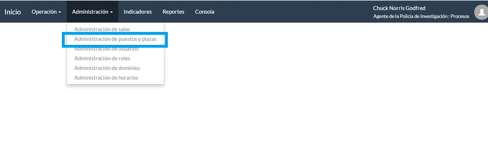
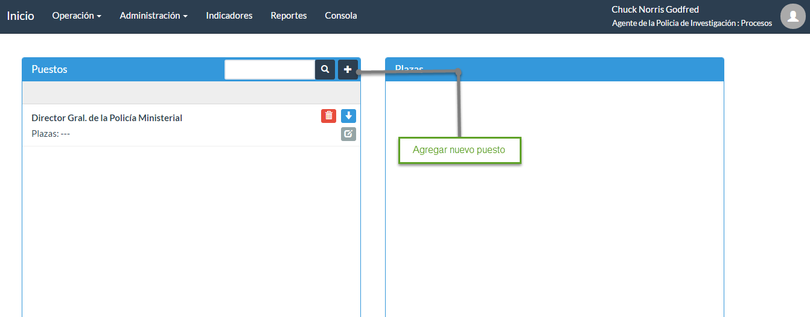
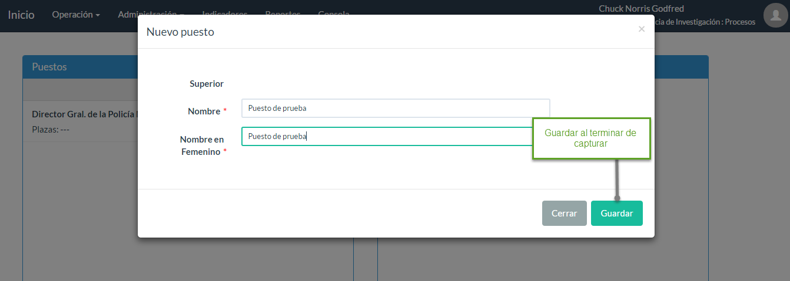
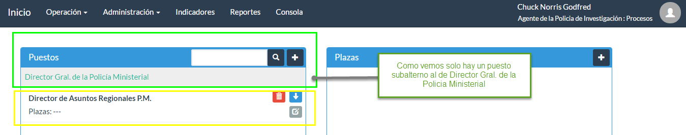

# Manual de Administrador LEXSYS
-------------------------------

El presente manual ha sido desarrollado de manera generica para adaptarse a cualquier usuario, sin embargo para cada cliente algunas pantallas, procedimientos, iconos, nombres, etc.  pueden cambiar, para el caso los procedimientos se generará un anexo donde se podrá contar con el detalle de cada uno de estos procedimientos con sus formularios y formatos.

## Objetivo

A continuación se presenta una guía de Administrador del Portal de Servicios (PS) donde aprenderemos a usar cada una de las características mencionadas con anterioridad.

El presente documento ha sido elaborado para guiar a los administradores operativos del Sistema de Gestión en el manejo de la plataforma informática, específicamente lo que respecta al denominado Portal de Servicios (PS), donde se llevan a cabo las labores de administración de Usuarios, Estructuras, Roles y Operaciones.

Aunque el PS es una interfaz completamente intuitiva, veremos una detallada explicación del uso y manejo de esta interfaz.

## Introducción

El Sistema Informático de Gestión para las instituciones que participan en el Procedimiento Penal sistematiza los procesos de gestión del Nuevo Sistema de Justicia Penal Acusatorio.

Las múltiples funcionalidades del Sistema Informático de Gestión brindan el apoyo, seguimiento y control necesario a los procesos en donde interviene la Institución donde se implementa el Sistema de Gestión Informático, apoyando su interconectividad con otros operadores de instituciones que forman parte del proceso penal, desde la noticia criminal, durante la investigación, persecución y juicio, hasta la ejecución de sentencias y el tratamiento previo a la liberación, conservando de principio a fin la participación y gestión de la defensa, traduciéndose en una mayor rápidez y eficacia en las comunicaciones, recursos procesales y ejecución de sentencias.

El Portal de Servicios (PS) del sistema pone a disposición del Administrador (sobre una aplicación web), un amplio conjunto de herramientas que le permiten realizar tareas de administración, supervisión, control, seguimiento, actualización y consulta de información a nivel administrativo; con efectos asociados e intrínsecos a la lógica de operación, los casos, los permisos y las transacciones.

## Breve descripción de la Funcionalidad.
-------------------------------------

El portal de servicios es la aplicación web que permite la administración operativa, del Sistema Informático de Gestión, la organización estructural institucional debe ser proporcionada por el cliente, sin embargo básicamente cada usuario del sistema pertenece a una región en particular en la cual tiene un puesto y una plaza asignada dentro de la institución.

La Administración General del sistema contempla 5 tipos de Administradores, los cuales pueden ser usuarios genericos o usuarios funcionales dentro del sistema.

Los usuarios administradores genericos son:

	AGE (Administración General de Estructuras)
	AGU (Administración General de Usuarios)
	AGR (Administración General de Roles)
	AOC (Administración Operativa de Casos)
	AOR (Administración Operativa de Roles)

	Imagen 1 Organigrama territorial

Se visualiza la organización territorial al cual pertenecen los puestos, plazas, roles y usuarios.

	Imagen 2 Organigrama Territorial

Es la manera en la que se organizan los diferentes niveles jerarquicos de puestos y plazas a las cuales pertenecen los usuarios.

Las múltiples herramientas del Portal de Servicios nos ofrecen las siguientes funcionalidades:

### Administración General de Estructura

Define los Puestos, Plazas y horarios que se crearán de manera general para generar la estructura jerarquica de la institución donde se asignará el operador que corresponda según sea el caso, hasta completar la estructura organizacional institucional. Dentro de esta administración es posible Crear, Editar y Eliminar cualquiera de estos elementos estructurales.

### Administracion General de Dominios

Delimita los permisos de las aplicaciones que cosumen el motor de la herramienta (API), es decir determina el acceso de las aplicaciones como el Escritorio de trabajo y el portal de servicios a los distintos recursos de la aplicacion como procedimientos y usuarios entre otros.

### Administración General de Roles

Define la función de los usuarios respecto a cada procedimiento del sistema, los privilegios y facultades de consulta y ejecución de los mismos. Constituidos únicamente por procedimientos adscritos al mismo operador para el cual fueron creados.

Es la funcionalidad encargada de asignar el conjunto de procedimientos a los operadores funcionales.

Es aqui donde se generan, editan y eliminan dichos roles por su puesto basado en la regla de negocio de la institución.

### Administración General de Usuarios

Define los usuarios de la organización, las estructuras orgánicas a las que pertenecen y captura los atributos de identidad de las personas. Las estructuras orgánicas pertenecen a una institución y sus puestos pertenecen a sólo un operador. Los usuarios deben pertenecer cuando menos a una estructura orgánica.
Es la funcionalidad con atributos para crear, eliminar y modificar usuarios, los cuales se detallan a continuación: 

	Usuarios funcionales: 

		Es aquel que posee los privilegios para ejecutar y visualizar casos en el escritorio de trabajo y agendar audiencias en su caso en el portal de servicios.

	Usuarios No funcionales:

		Es aquel que posee los privilegios para la administración del sistema, estos usuarios no interactúan directamente con el Escritorio de Trabajo.

### Administración de Operaciones

La siguiente funcionalidad asigna usuarios a los roles que pertenecen al mismo operador y asigna a los usuarios privilegios específicos en su asignación de roles. 

Esta función la realizan dos tipos de operadores que tienen como finalidad la organización de los roles, casos, y horarios:

	Administrador Operativo de Roles (AOR): 

		Este operador es el encargado de asignar los horarios y 	relaciona las plazas con los usuarios funcionales de operación 	a los usuarios funcionales.

	Administración Operativa de Casos (AOC):

		Este operador permite realizar cambios de titularidad, 	restringir facultades, bloquear procesos de gestión, 	enmascarar, reservar y cerrar casos.

### Administración General de Casos

Permite manejar la asignación de un caso particular a ser ejecutado con un procedimiento específico, indicado selectivamente el usuario o usuarios comisionados. Esta operación es Acotada por el rol al que pertenece el usuario que accede a esta funcionalidad.

### Reportes 

Ofrece un catálogo de reportes relativos a los procesos ejecutados por los distintos operadores, organizados por tipos de caso, estructuras orgánicas, usuarios y roles; permite medir tiempos de ejecución, sesgos de tiempo y actuación, entre otros.
Reportes de Servicio

Ofrece un catálogo de reportes relativos al desempeño tanto del sistema como de los usuarios, organizados por tipos de caso, estructuras orgánicas y roles; permite medir niveles de servicio, tiempos de atención y tiempos de ejecución, entre otros.

### Indicadores

Ofrece un catálogo de reportes relativos a los indicadores que permitan una mejor gestión de la procuración de justicia y persecución del delito, generando un conjunto normalizado de datos que se extraen en diversos formatos para su remisión a los solicitantes.

### Consola 

Es el módulo para monitorear las aplicaciones y usuarios conectados al motor de la herramienta y llevar un registro y control de que y quien tiene actividad en la aplicación.

# Manual:
# Administrador Portal de Servicios
------------------------------------------------

En este manual detallaremos el uso y manejo de cada módulo y elemento del denominado Portal de Servicios, que en lo sucesivo llamaremos PS, Donde el administrador podrá gestionar creación de usuarios, roles, operación y estructura de la herramienta.

## Modo de acceso al Portal de Servicios (PS)
-----------------------------------------------

Para firmarnos en este modo basta con abrir cualquier navegador, en caso de la elaboración de este manual se utilizó Google Chrome, mismo que se recomienda para el uso del Sistema Informático de Gestión.

	Imagen 1 (Google Chrome)

Una vez abierto el navegador deberemos teclear una dirección URL del tipo http://midominio o bien del tipo XXXX.XXXX.XXXX.XXXX:3004, donde 3004 es el puerto por donde nos comunicamos con el Portal de Servicios.

	Imagen 2 (URL)

# Administración General de Estructura
------------------------------------------

Es el módulo donde se crea la plataforma de trabajo para el usuario, es decir puesto y plaza que ocupara el usuario.
Como primer paso a la Administración de General de Estructura, debemos firmarnos con  un usuario con estos privilegios, para este casos nos firmamos con un usuario generico creado para este fin, pero puede usarse un usuario funcional asignando los mismo permisos, para este caso: 

		User: AGE, pass:1111. 

y pulsamos Entrar.

	Imagen 3 (Login)

Al firmarnos podremos seleccionar un operador siempre y cuando contemos con los privilegios necesarios, desplegarán todos los operadores disponibles para la institución.

	Imagen 4 (Selección de Operador)

## Administración de puestos y plazas 
------------------------------------

Las opción habilitada para este usuario en el menú contextual es: "Administración" y a su vez al desplegar este submenú nos mostrará la opción "Administración de Puestos y Plazas", es aquí donde podran crearse y editarse dichos elementos de la estructura de la organización.

	Imagen 5 (Selección Administración de Puestos y Plazas)

## Agregar un Nuevo Puesto
--------------------------------------

Para agregar un nuevo puesto, es necesario dar clic en el botón (+) como se muestra a continuación.

	Imagen 6 (Nuevo puesto1)

Al agregar un nuevo puesto podemos ver a continuación se listan los campos que deben llenarse, en el campo llamado "Superior" se llena de manera automatica cuando hay un puesto superior inmediato en este caso es el puesto más alto en la jerarquía.

	-	Nombre
	-	Nombre en femenino

Donde se deberá capturar el nombre del puesto correspondiente, en el campo "Nombre" y confirmarlo en el campo "Nombre en femenino". 
Una vez capturados los datos, es necesario dar clic en el botón "Guardar" para poder continuar con el proceso.

	Imagen 6 (Nuevo puesto2)

## Editar el puesto
---------------------------------------

Una vez que creamos un puesto nuevo es posible editarlo presionando el boton con el símbolo de "Edición"con los permisos correctos.

 

	Imagen 7 (Edición de Puesto1)

Al presionar el botón de "Edición" veremos la siguiente pantalla. Como apreciamos en la iimagen aterior son solo dos campos los que se pueden editar:

	-	Nombre
	-	Nombre en femenino

Podemos editar el nombre y corregimos algún campo que así lo precise y selccionamos "Guardar".

 

	Imagen 7 (Edición de Puesto1)

## Despliega los puestos subalternos de manera jerárquica (organigrama)
----------------------------------------------------
Para desplegar los puestos subalternos relacionados con el puesto principal que buscamos, seleccionamos el símbolo (Flecha hacia abajo) y observaremos un nivel descendente en el  organigrama como se muestra en la imagen que continua.

	
	Imagen 8 (Jerarquia de puestos 1)

Una vez seleccionado el botón de (Flecha hacia abajo), veremos como se despliegan los subalternos del puesto principal.

	Imagen 9 (Jerarquia de puestos 2)

Nótese que en el siguiente nivel del organigrama es el puesto de Director de Asuntos Regionales PM  resaltado en color verde y aprecie que se sigue mostrando el nivel superior inmediato al puesto mostrado (en este caso Director Gral. de la Policía Ministerial),  el resaltado en rojo corresponde a las diferentes plazas con el mismo nombramiento del puesto enmarcado en amarillo.

## Eliminar puesto
----------------------------------

Al seleccionar el botón "Borrar" con el símbolo siguiente (Cesto de básura) nos abre una ventana emergente  que nos cuestiona si realmente queremos borrar el elemento para estar completamente seguros del proceso que se está realizando como se muestra en la siguiente figura.

	Imagen 10 (Eliminar puesto1)

Confirmamos con el botón de "Eliminar"

	Imagen 11 (Eliminar puesto2)

Nos confirmará que se ha eliminado el puesto de manera exitosa.

## Agregar plaza
----------------------------------

Una Plaza es una posición de alguno de los puestos disponibles, para agregar una plaza nueva debemos seleccionar el puesto al cual deseamos agregar nuevas plazas y después seleccionamos el símbolo (+) en el panel de Plazas nos desplegará las plazas que tiene actualmente el puesto o en blanco sino cuenta con plazas dicho puesto.

	Imagen 12 (Nueva Plaza1)

Nos mostrará la siguiente panatalla con los siguientes campos para capturar:

	* Puesto: es el nombre de la posición en la organización.
	* Nombre: es el nombre de la plaza a donde se asiganará el usuario
	* Oficina territorial: Oficina a la cual pertenece la plaza
	* Unidad Territorial 
	* Superior: Es el puesto inmediato superior
	* Horario: es el horario de la jornada laboral
	* Dominio:
	* Facultades del usuario: nos permite asignarlo como "Aspirante a titular"

Al finalizar pulsamos "Guardar".

	Imagen 12 (Nueva Plaza1)

## Editar la plaza
-------------------------------

La edición del elemento Plaza nos es muy útil para correcciones y es muy sencillo de usar, para usar este atributo es necesario seleccionar el mismo botón con el símbolo de "edición", al presionar el boton nos mostrará la siguiente pantalla:

	Imagen 13 (Edición de Plaza1)

Donde se podrán editar los campos:

		* Nombre: es el nombre de la plaza a donde se asiganará el usuario
	* Oficina territorial: Oficina a la cual pertenece la plaza
	* Unidad Territorial 
	* Superior: Es el puesto inmediato superior
	* Horario: es el horario de la jornada laboral
	* Dominio:
	* Facultades del usuario: nos permite asignarlo como "Aspirante a titular"

Una vez corregido el campo que nos es preciso entonces se procede a "Guardar".

	Imagen 14 (Edición de Plaza2)

## Eliminar plaza.
--------------------------------------------

Es posible eliminar la plaza seleccionando el botón "Eliminar", lo presionamos se abre la ventana emergente para pedirnos confirmación de eliminar dicho elemento como se muestra en la siguiente figura: 

	Imagen 15 (Eliminar Plaza)

## Administración de Horarios
-----------------------------------------

El Administrador General de Estructura puede gestionar los horarios, es decir crear, eliminar y editar, Este elemento de la Estructura organizacional indica los horarios de la jornada laboral, estos horarios deben ser forzosos aunque la aplicación puede arreglarselas sin ellos, se definen como forzosos para llevar control sobre los recuros de la herramienta 

En la figura que sigue seleccionaremos "Administración de Horarios".

	Imagen 16 (Seleccion de Administración de horarios)

Una vez seleccionada esta opción veremos una pantalla con las horarios disponibles si existiera uno o bien en blanco con la con opción de crear un nuevo horario. 

	
	Imagen 17 (Administración de horarios) 

## Creando un nuevo horario
----------------------------------------

Para crear un horario, es preciso seleccionar el botón identificado con el signo (+) que por supuesto significa agregar un nuevo elemento, al presionarlo tendremos la siguiente pantalla.

	Imagen 18 (Creano un nuevo horario)

Donde:

	-	Nombre: corresponde al nombre del horario.

	-   Archivo (.ica, .ics) es un archivo que se exporta desde una herramienta de calendario normalmente asociada a una aplicación de correo electronico como 	  gmail o outlook para tal caso procedemos de la siguiente manera.

			* Exportarlos de una cuenta de Google

					Si tienes varias cuentas de Google, puedes exportar tus calendarios de una cuenta e importarlos a otra.

					En un ordenador, inicia sesión en la cuenta de Google cuyos calendarios quieras exportar. Solo puedes exportar calendarios con un ordenador, pero no con un teléfono o tablet.

					Sigue las instrucciones para exportar tu calendario. Tendrás que descargar un archivo ICS en tu ordenador.

					Exportar los eventos de todos los calendarios de tu lista "Mis calendarios"

					1.- Abre Google Calendar en un ordenador. Solo puedes exportar calendarios con un ordenador, pero no con un teléfono o tablet.

					2.- Arriba a la derecha, haz clic en Configuración settings gear button > Configuración.

					3.- Abre la pestaña Calendarios.

					4.- Haz clic en Exportar calendarios (entre los apartados "Mis calendarios" y "Otros calendarios").

					Se descargará un archivo ZIP en tu ordenador. Si abres el archivo .ZIP, verás los archivos .ICS de todos tus calendarios, mismo que usaremos para crear el horario en la herramienta

					ó

					Exportar los eventos de un calendario

					1.- Abre Google Calendar en un ordenador. Solo puedes exportar calendarios con un ordenador, pero no con un teléfono o tablet.

					2.- Ve al apartado Mis calendarios del lateral izquierdo.

					3.- A la derecha del calendario que vas a exportar, haz clic en el menú desplegable  > Configuración del calendario.

					4.- Haz clic en Exportar este calendario.

					Se empezará a descargar un archivo ICS de tus eventos y podremos usar el archivo para el horario de nuestra herramienta.

			* En Outlook

				 	1.- Ejecuta Outlook y haz clic en el módulo "Calendario" en la barra de herramientas de la parte superior de la ventana.

				 	2.- Selecciona el calendario deseado en el cuadro del lado izquierda, si corresponde, y escoge "Guardar como" desde "Archivo" en la barra de menú superior.

				 	3.- Escribe el nombre del archivo y selecciona "Formato iCalendar (*.ics)" desde el menú desplegable que está al lado de "Guardar como tipo".

				 	4.- Presiona el botón "Más opciones" y selecciona "Especificar fechas" desde el menú desplegable que está al lado de "Rango de fecha".

				 	5.- Ingresa la fecha inicial y la final para el calendario en los campos correspondientes y después haz clic en el botón "Aceptar".

				 	6.- Presiona el botón "Guardar"

Una vez que hemos seleccionado el archivo .ical o .ics seleccionamos el botón "Guardar" como se muestra en la siguienet figura.

	Imagen 19 (Creano un nuevo horario)

Una vez que guardamos le horario podremos ver el horario generado recientemente y el horario en formato ".ics" con posibilidad de descargar

	Imagen 20 (Creano un nuevo horario)

## Editando un Horario
--------------------------------

Es posible editar un horario en varias circunstancias, tales como, cambio de horario de verano entre otras, para editar un horario en la herramienta, ubicamos el horario que deseamos editar y seleccionamos el botón "Editar" , enseguida obtendremos la siguiente pantalla en el panel de la derecha.

	Imagen 21 (Editando un horario)

Donde podremos editar el "Nombre del horario" y el horario se edita por fuera con la herramienta que usamos para descargar el archivo ".ics o .ical" y lo cargamos nuevamente como en la imagen 19.

# Administración de dominios
-----------------------------------

Como lo mencionamos en la funcionalidad del Portal de Servicios,  controlar los permisos de las aplicaciones que consumen el API es decir el Escritorio de Trabajo, el Portal de Servicios entre otros.

# Administración general de roles
------------------------------------

Es el módulo donde se asignan los atributos, privilegios, permisos, unidades territoriales, es decir los "Roles" de la plataforma de trabajo para el usuario, es decir la plaza que ocupara este.

En el Módulo anterior "Administración General de Estructura" se crean los Puestos y Plazas donde el Puesto es el perfil de la posición que ocupara y la Plaza es el Puesto asignado a alguna Unidad Territorial y puede haber varias plazas del mismo Puesto.

Escibimos la dirección URL del Portal de Servicios, una vez escrita la dirección damos "Enter" y veremos una ventana que nos indicará el inicio de sesión (Login), nos pedirá el usuario y contraseña  mismo que le será asignado atreves de la Mesa de Servicio definida por el cliente; tecleamos el Usuario y Contraseña y presionamos el botón de entrar.

Recuerda que para Gestionar los roles debemos contar con una cuenta con esta funcionalidad en este caso usaremos una cuenta generica:

	 User: AGR Pass:1111.

	
		Imagen 22 (login Administración de Roles)

Nos solicitará seleccionar un operador desde el cual debemos trabajar, se desplegarán todos los operadores disponibles para la institución.

	Imagen 23 (Selección de operador)

## Operación de roles
-------------------------------

Una vez que nos firmamos y seleccionamos un operador; para el caso de nuestro manual seleccionaremos como Ministerio Público - Enlace con Poder Judicial : Estatal

	Imagen 24 (Selecció de la operación a realizar)

Una vez seleccionada la opción de "Administración de roles" podemos ver que estamos firmados como MP y veremos también la siguiente pantalla.

	Imagen 25 (Administración de roles)

## Nuevo Rol
----------------------

Recordemos que al firmarnos seleccionamos un Operador que en este caso fue Ministerio Público y al agregar un nuevo rol veremos solo los procedimientos o pantallas asignados a dicho operador; para agregar un nuevo rol es necesario seleccionar el botón con el símbolo (+) y posteriormente nos mandará la siguiente pantalla.

	Imagen 26 (Nuevo rol)

Dentro de la pantalla nos aparecen dos campos: Nombre y Permisos por procedimiento.

	•	En el campo de Nombre, el sistema nos solicita el nombre del nuevo rol que se desea agregar.

	•	Los siguientes atributos pueden ser dados a cada procedimiento o pantalla ya sea en un pull completo o bien seleccionar solos los atributos que así 		convenga asignar a estos procedimientos, mismos que son asignados al nuevo rol; estos procedimientos  están enumerados con un número clave a manera de		identificador y como una mejor práctica.

Los atributos que se pueden asignar a los procedimientos que el operador con el cual el usuario se firmo son:

	o	Ejecución
	o	Eliminación
	o	Eliminación documentos
	o	Sustitución 
	o	Lectura
	
Una vez que seleccionamos atributos y le asignamos un nombre al nuevo rol, entonces guardamos la información. 

## Editando el Rol
--------------------------------

Para editar la información de un rol existente que bien puede ser para corregir un dato, un atributo o privilegio, seleccionamos el símbolo de (Edición) del rol que deseamos editar como lo muestra la siguiente figura siguiente:

	Imagen 27 (Editando roles)

Lo que veremos como resultado será el siguiente:

	Imagen 28 (Editando roles)

La información que se puede editar es:

	 - Nombre 
	 - Atributos

Podemos quitar o agregar más atributos sobre los procedimientos o pantallas sobre los cuales estamos trabjando, según sea el caso.
Una vez realizado los cambios, salvamos los cambios con el botón "Guardar".

# Administrador General de Usuarios
----------------------------------------

Para gestionar el recurso "Administración General de Usuarios" es necesario contar con los permisos suficientes, en este caso usaremos la cuenta generica con los siguientes datos:

	USER: AGU
	PASS: 1111

Una vez que nos firmamos en el "Portal de Servicios", recordemos que nos pedirá seleccionar un operador para efectos de la guía continuaremos usando el de Ministerio Público, pero puede ser el de su elección.

Seleccionamos en el menú contextual "Administración" y una vez que nos despliega las opciones seleccionamos "Administración de Usuarios" como se muestra en la siguiente figura. 

	Imagen 29 (login y seleccion de menú)

Cuando seleccionamos dicha opción obtenemos este resultado:

	Imagen 30 (login y seleccion de menú)

## Creando un Usuario
-----------------------------------

Para generar un nuevo usuario es muy simple sin embargo no basta con crear un usuario para poder usar la cuenta, es necesario seguir una serie de pasos que iremos enumerando hasta dejarlo funcional y que el usuario quede con los privilegios, unidad territorial y roles apropiados a su perfil.

Como primer paso deberemos presionar el botón con el símbolo (+) podremos ver la siguiente pantalla:

	Imagen 31 (Administración de usuarios)

Estos son los campos que deben llenarse, solo explicaremos los pertinentes, el resto por obviedad se complementa.

	-	*Nombre 
	-	*Apellido Paterno
	-	*Apellido Materno
	-	*Usuario: Se asigna un nombre de usuario de acuerdo a la nomenclatura indicada por la organización.
	-	*Autenticación: Es una medida para validar que realmente se trata del usuario correcto, las opciones son las siguientes: 

	      * Huella digital, contraseña,  		 huella digital con contraseña.

	-	 Prefijo: Como muestra en la imagen puede ser del tipo Lic.
	-    Acceso: si se marca la casilla indica que el usuario esta activo

Los marcados con * son obligatorios.

Al terminar de llenar de los campos, se tiene que dar clic en el botón "Guardar".

## Editando un Usuario
----------------------------------------

Para editar un Usuario, es muy simple, seleccionamos el usuario que deseamos corregir o editar y damos clic en el siguiente botón (Edición) como se muestra en la siguiente figura.

	Imagen 31 (seleccion edicion usuarios)

Cuando seleccionamos el usuario y presionamos el botón (Edición), aparecerá la pantalla de "Administración de usuarios" con los mismos datos que se mencionaron anteriormente y que ya hemos explicado, recordemos que los marcados con * son mandatorios.

	Imagen 32 (Administración de usaurios)

Ya hemos explicado cada campo pertinente, editamos lo que nos sea preciso y presionamos el botón "Guardar".

## Eliminando un Usuario
-----------------------------------------

Para "Eliminar" un usuario es más sencillo que crearlo, seleccionamos el botón con el símbolo (bote de básura) 

	Imagen 33 (Eliminación de usuarios)

Al seleccionarlo nos pedirá confirmación de la eliminación del usuario y confirmamos con el botón de "Aceptar".

# Indicadores 
--------------------------

El módulo de "Indicadores" es aquel que nos ofrecerá los informes de como se comporta la operación del día a día, para saber acerca de estos Reportes favor de referirse al anexo con esta información. En este manual solo se mostrará como desplegar en pantalla un "Indicador".

Una vez que nos firmamos en el Portal de Servicios, seleccionamos en el menú principal "Indicadores" y nos mostrará la siguiente pantalla

	Imagen 34 (Selección de indicadores)

En la pantalla de "Indicadores"  seleccionamos la persiana y nos mostrará todos los indicadores disponibles para ejecutar; una vez seleccionado el reporte que deseamos visualizar debemos seleccionar el rango de tiempo en el cual queremos generar el reporte, para ello seleccionamos el calendario de "Fecha de inicio" que es la fecha de la que partirá para comenzar la busqueda de las coinicidencias de nuestro reporte; después de ello seleccionaremos la "Fecha de término", es decir cierra el rango de tiempo en la cual el sistema realizará la búsqueda; cuando estemos seguros de estos datos que se nos solicita, entonces seleccionamos "Preparar datos".

	Imagen 35 (Indicadores)

	****preguntar del módulo de reportes****

Una vez generado el reporte podemos exportarlo a Excel y de esta manera hacerlo portable y visualizarlo en culaquier ambiente que no tenga la aplicación disponible

# Reportes.
---------------------------

# Consola
---------------------------

# Administración de salas.
----------------------------

La "Agenda" de audiencias es un mecanismo para programar las audiencias en fecha, hora y sitio, es decir las audiencias se pueden programar en un horario valido en una fecha valida y en una sala de audiencia valida sin que se empalmen estas audiencias es una herramienta confiable segura y eficaz para el administrador de las salas de audiencia.

Seleccionamos dentro del menú principal "Administración" la opción "Administración de Salas". 

	Imagen 36 (Administración de salas)

Una vez hecho esto, nos mostrará  los casos que están listos para audiencia  y que deben agendarse. Debemos ver una pantalla como la que se muestra a continuación, dividida en dos paneles mismos que se definen más adelante.

	Imagen 36 (Administración de salas)

Panel Izquierdo corresponde a  la paleta de las audiencias y el panel derecho a la paleta del calendario mismos que describiremos a continuación

## El Panel Izquierdo (audiencias)
----------------------------------------

Lo  describimos  a continuación.

	Imagen 37 (Panel de audiencias)

### Filtro 

Nos ayuda a acotar criterios  de búsqueda por los siguientes parámetros:

	•	Estado:

		o	Sin agendar
		o	Reservados
		o	Confirmados

	•	Salas:

		o	Cerezo
		o	Constitución		
		o	Federación
		o	Independencia
		o	Nación
		o	República
		o	Revolución

	•	Jueces:

		o	Muestra los jueces disponibles. ( En este caso Ana Concepción Gutiérrez Pereyra)

	•	Ordenar por Fechas:

		o	Fecha de solicitud
		o	No. de procedimiento
		o	Fecha de Audiencia

Definimos los criterios de búsqueda y al final seleccionamos el botón  "Aplicar Filtros" como se muestra en la siguiente ilustracón.

	Imagen 38 (Criterios de filtrado)

### Barra de Búsqueda
----------------------------------

La barra de búsqueda es aquella donde se podrán buscar casos que se pueden agendar o casos agendados el criterio de búsqueda de los casos es:
	
	 NIC
	 NAC
	 NUC.

Como vemos en la siguiente imagen, se puede apreciar que 

